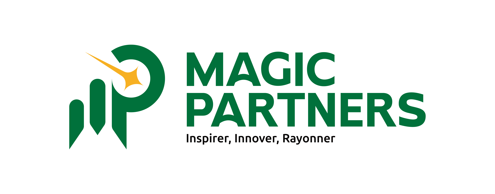

# MAGIC PARTNERS - Média, Communication, Événementiel & Studio Audiovisuel



MAGIC PARTNERS est une agence créative basée à Cotonou, Bénin, offrant des expériences à 360° dans les domaines du média, de la communication et de l'événementiel. Ce projet est le site web officiel de l'agence, conçu pour présenter ses pôles d'expertise et son studio audiovisuel (MAGIC+ STUDIO).

## 🚀 Fonctionnalités

- **Expérience Immersive** : Design moderne avec des animations fluides (Framer Motion).
- **Architecture de Services** : Présentation détaillée des pôles Média, Communication et Événementiel.
- **MP STUDIO** : Section dédiée à la production audiovisuelle.
- **PME Boost** : Programme spécialisé pour l'accompagnement des entreprises.
- **Optimisation SEO** : Meta tags dynamiques, sitemap et robots.txt pour une visibilité maximale.
- **Conformité RGPD** : Gestion des cookies et politiques de confidentialité intégrées.
- **Design Responsive** : Optimisé pour tous les écrans (Desktop, Tablette, Mobile).

## 🛠️ Stack Technique

- **Framework** : [React](https://reactjs.org/) (TypeScript)
- **Bundler** : [Vite](https://vitejs.dev/)
- **Styling** : [Tailwind CSS](https://tailwindcss.com/)
- **Animations** : [Framer Motion](https://www.framer.com/motion/)
- **Icônes** : [Lucide React](https://lucide.dev/)
- **Composants UI** : Inspirés de [shadcn/ui](https://ui.shadcn.com/)

## 📦 Installation & Utilisation

### Prérequis

- [Node.js](https://nodejs.org/) (Version LTS recommandée)
- npm ou yarn

### Installation

```bash
# Cloner le projet
git clone [url-du-repo]

# Installer les dépendances
npm install
```

### Développement

```bash
# Lancer le serveur de développement
npm run dev
```

### Production

```bash
# Générer le build de production
npm run build
```

## 📁 Structure du Projet

```text
src/
├── app/
│   ├── components/    # Composants React (Header, Footer, Sections, SEO)
│   └── App.tsx        # Point d'entrée de l'application & Routage
├── assets/            # Images, PDF et fichiers statiques
├── styles/            # Fichiers CSS et configuration Tailwind
└── main.tsx           # Initialisation React
public/                # Fichiers statiques (robots.txt, sitemap.xml)
```

## 📈 SEO & Performance

Le site utilise un composant `SEO.tsx` pour gérer dynamiquement les métadonnées de chaque page. Les fichiers `sitemap.xml` et `robots.txt` sont situés dans le dossier `public/` pour faciliter l'indexation par les moteurs de recherche.

## 📄 Licence

Ce projet est la propriété de **MAGIC PARTNERS SAS**. Les composants tiers sont utilisés sous leurs licences respectives (MIT pour shadcn/ui).

---

**MAGIC PARTNERS** - *Inspirer, Innover, Rayonner.*
[magic-partners.bj](https://magic-partners.bj)
